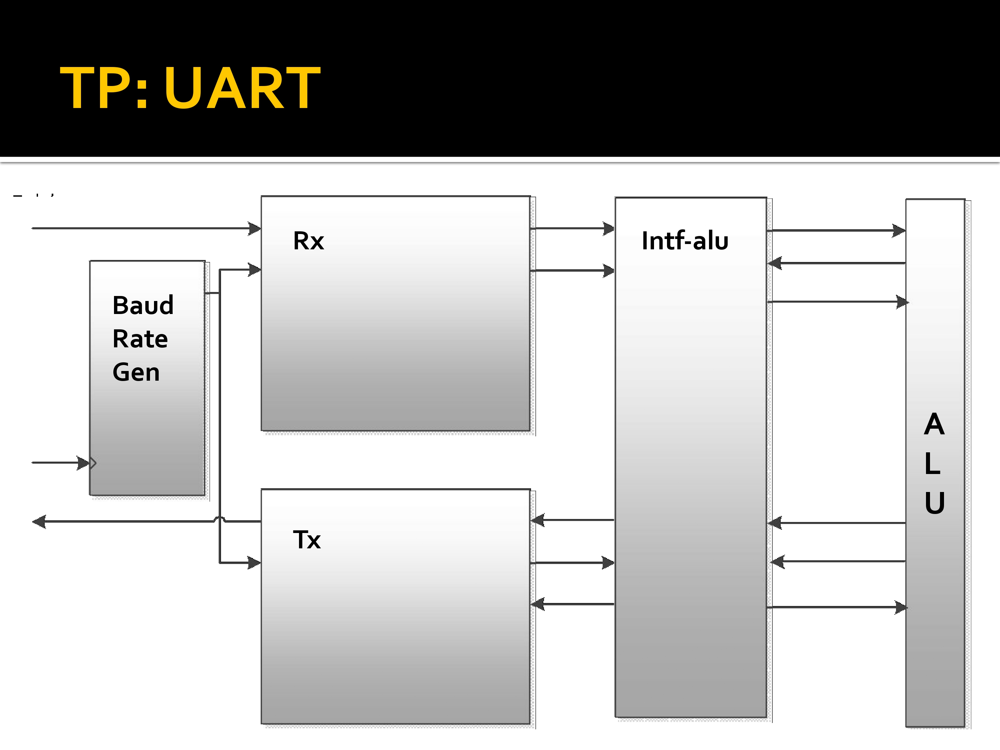

# Trabajo practico 2 de Arquitectura de Computadoras - UART

El trabajo práctico trata sobre la implementación de un UART (Universal Asynchronous Receiver and Transmitter) utilizando Máquinas de Estado Finitas (FSM) en Verilog. Se debe diseñar un sistema que incluya:

- Generador de Baud Rate, que controla la velocidad de transmisión de datos.
- Receptor UART (Rx), que sigue una secuencia de estados para recibir datos en serie, sincronizándose con los bits de inicio, datos y parada.
- Transmisor UART (Tx), que envía datos en serie con el formato adecuado.
- Interfaz con una ALU, para procesar los datos recibidos.

